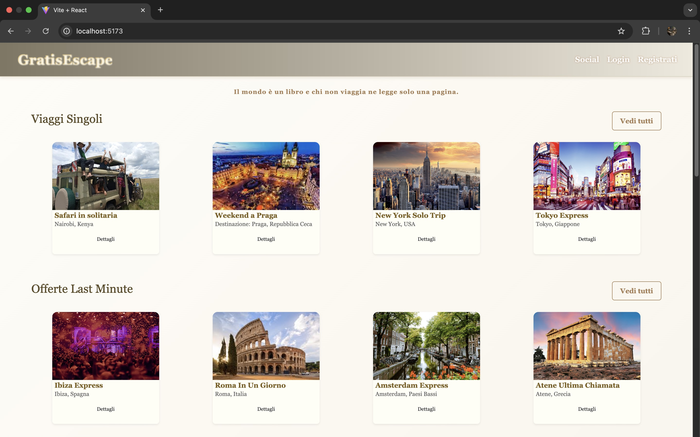

# GratisEscape - Progetto Completo

**GratisEscape** è un'applicazione web full-stack sviluppata per gestire un'agenzia di viaggi. Consente a utenti e admin di interagire tramite un sistema di richieste, gestione viaggi e chat in tempo reale.


##  Screenshot della Home

Ecco un’anteprima dell’interfaccia utente principale:




Il progetto è suddiviso in due directory principali:

* `/frontend` → Client React con Redux, Bootstrap, WebSocket
* `/backend` → API REST Spring Boot con PostgreSQL, JWT, WebSocket, Cloudinary e email

---

##  Requisiti

| Componente | Versione Consigliata |
| ---------- | -------------------- |
| Node.js    | 18+                  |
| Java       | 21                   |
| Maven      | 3.8+                 |
| PostgreSQL | 13+                  |

---

##  Struttura della Repo

```
GratisEscape/
├── frontend/           # App React + Redux + Bootstrap
│   ├── README.md       # Info frontend
│   └── ...
├── backend/            # Spring Boot REST API
│   ├── README.md       # Info backend
│   └── ...
├── README.md           # (questo file)
```

---

##  Configurazione Ambiente (`env.properties`)

Crea un file `env.properties` nella cartella `backend/` con i seguenti parametri (senza inserire valori reali nel repository pubblico):

```properties
# Database
postgresql.password=YOUR_POSTGRES_PASSWORD

# Cloudinary
cloud_name=YOUR_CLOUD_NAME
api_key=YOUR_CLOUDINARY_API_KEY
api_secret=YOUR_CLOUDINARY_API_SECRET

# Gmail SMTP
gmail.from=YOUR_GMAIL_ADDRESS
gmail.password=YOUR_GMAIL_PASSWORD

# Google OAuth2
google.client-id=YOUR_GOOGLE_CLIENT_ID
google.client-secret=YOUR_GOOGLE_CLIENT_SECRET
```

>  **Attenzione:** Non committare questo file nel repository. Aggiungilo a `.gitignore`.

---

##  Avvio del progetto

### 1. Clona la repo

```bash
git clone https://github.com/tuo-utente/GratisEscape.git
cd GratisEscape
```

### 2. Backend

```bash
cd backend
# Compilazione
mvn clean install

# Avvio
mvn spring-boot:run
```

### 3. Frontend

```bash
cd ../frontend
npm install
npm run dev
```

> Il backend gira su `http://localhost:8080`, il frontend su `http://localhost:5173`

---

##  Funzionalità principali

###  Autenticazione

* Login classico (JWT)
* Login con Google (OAuth2)
* Registrazione con conferma email
* Reset password con token via email
* Cambio password forzato per admin al primo accesso

###  Utente

* Visualizza viaggi per categoria
* Cerca viaggi per nome
* Invia richieste all'agenzia
* Chatta in tempo reale con admin per ogni richiesta
* Riceve email con risposta
* Notifiche WebSocket con badge rossi per nuove risposte o messaggi

###  Admin

* CRUD viaggi (con upload immagini via Cloudinary)
* Visualizza richieste utenti
* Risponde alle richieste via email o chat
* Badge notifiche per nuove richieste e messaggi non letti

---

##  UI e Design

* Interfaccia responsiva con **Bootstrap 5**
* Animazioni fluide con **Framer Motion**
* Icone con **react-icons** e **react-bootstrap-icons**
* Stili personalizzati in `styles/custom.css`

---

##  Stato globale (Redux)

* Autenticazione gestita con Redux (`authReducer`)
* Notifiche gestite tramite slice dedicato (`notificationSlice`)
* Stato sincronizzato con `localStorage` per persistenza

---

##  Interceptor Axios

Ogni richiesta API dal frontend include automaticamente il token JWT salvato in `localStorage`, grazie a un interceptor Axios configurato in `services/api.js`.

---

##  Proxy sviluppo (Vite)

Nel file `vite.config.js`, il frontend è configurato per fare proxy verso il backend locale su `localhost:8080`, per evitare problemi CORS:

```js
proxy: {
  "/auth": { target: "http://localhost:8080", changeOrigin: true },
  "/richieste": { target: "http://localhost:8080", changeOrigin: true },
  "/api/chat": { target: "http://localhost:8080", changeOrigin: true },
}
```

---

##  Routing React

Il routing è gestito dinamicamente tramite un array `routes.js`, importato in `App.jsx`, che utilizza `<Routes>` e `<Route>` da `react-router-dom`.

---

##  Sicurezza

* Spring Security con JWT e OAuth2
* Filtro `JwtAuthFilter`
* CORS configurato per `http://localhost:5173`
* Ruoli: `ADMIN`, `UTENTE`
* Endpoint protetti con `hasRole()`

---

##  Principali Endpoint REST (Backend)

### AuthController (`/auth`)

* `POST /register` - registrazione con email
* `GET /confirm?token=...` - conferma email
* `POST /login` - login JWT
* `POST /change-password` - cambio password autenticato
* `POST /change-password-first` - primo accesso admin

### PasswordResetController

* `POST /forgot-password` - invio email reset
* `POST /reset-password` - conferma cambio

### ViaggioController (`/viaggi`)

* `GET /` - tutti i viaggi
* `GET /categoria/{categoria}` - per categoria
* `GET /search?q=...` - ricerca
* `POST /` - crea viaggio (admin)
* `PUT /{id}` - modifica viaggio (admin)
* `DELETE /{id}` - elimina (admin)

### RichiestaController (`/richieste`)

* `POST /` - nuova richiesta (utente)
* `GET /` - tutte le richieste (admin)
* `GET /mie` - richieste dell'utente
* `POST /{id}/rispondi` - risposta (admin)
* `DELETE /{id}` - elimina richiesta (admin)

### ChatController (`/api/chat`)

* `POST /{richiestaId}` - invio messaggio
* `GET /{richiestaId}` - chat completa
* `GET /{richiestaId}/unread?mittente=...` - non letti
* `PUT /{richiestaId}/mark-read` - segna letti

### WebSocket

* Endpoint: `/ws-chat`
* Canale: `/topic/public`
* MessageMapping: `/app/chat.sendMessage`

---

##  Test

Backend:

* `AuthIntegrationTest` con MockMvc per login e reset password
* Test generici inclusi con `spring-boot-starter-test`

---

##  Persistenza e Database

* Database: PostgreSQL (`AgenziaViaggi`)
* JPA Entities:

    * `User`
    * `Viaggio`
    * `Richiesta`
    * `MessaggioChat`
* Relazioni: OneToMany per messaggi per richiesta

---

##  Note Finali

* Admin predefinito viene creato al primo avvio se non esiste:

    * Email: `admin@gratisescape.com`
    * Password: `Admin123!`
* Cloudinary gestisce le immagini dei viaggi
* Le email sono inviate tramite SMTP Gmail
* Il sistema è completamente funzionante in locale

---

##  Pronto all'Uso

> Puoi clonare la repo, configurare il file `env.properties`, e avviare frontend e backend per testare tutto localmente.

Controlla anche i file README locali in `/frontend` e `/backend` per ulteriori dettagli.

---

Creato da GratisEscape Team.
